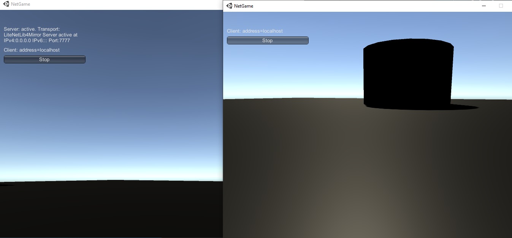

# NetGame

## What's new?

There is no new features.

## About project

Demo multiplayer game made with Unity3D. It only shows that you can join to game as a host and in separate window as a player. This is only example of implementing simple multiplayer functionality and this is definitely NOT a playable game.

To run this game, you have to run it with two separate windows. First window will be local host, second will be our player like on the screen below.

Screenshot below:

## Technologies used in the project

* Unity3D
* Mirror (for networking)

## Goals

Main goal is to learn how to set up multiplayer functionality in the game.

## License

My project is under BSD-2-Clause license. You can use some parts from my code but remember to credit me as an appreciation to my work! Thanks! Awoo!

© 2022 Paweł "Wilczeq/Vlk" Turoń
